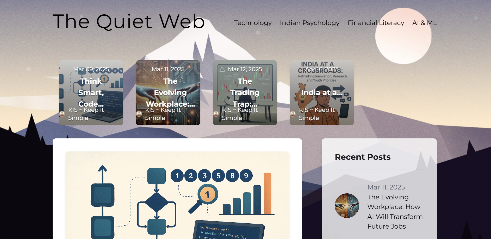
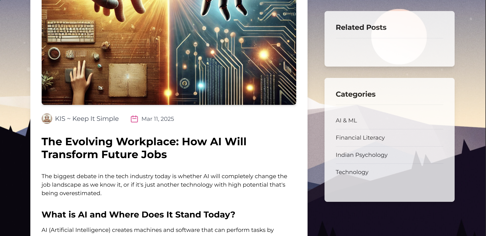
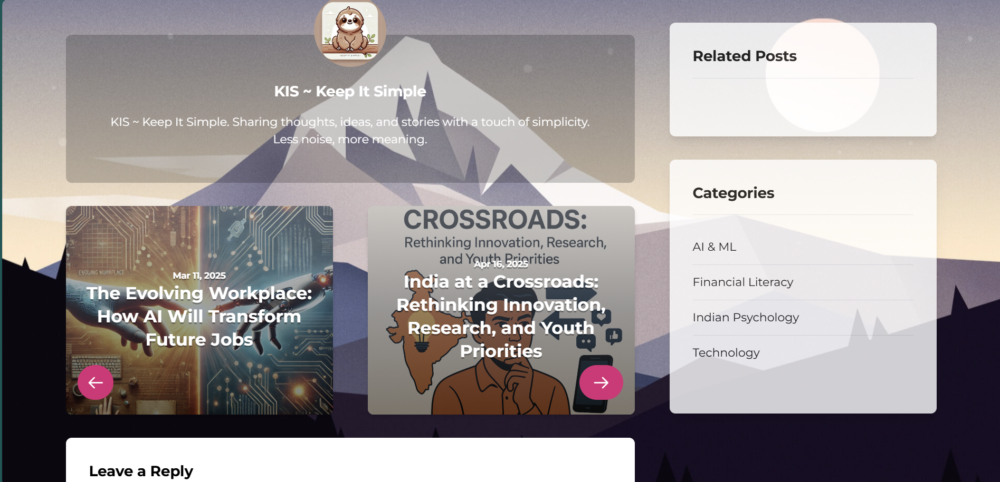

# Personal Blog Website

A full-fledged personal blog platform built using React, Tailwind CSS, and GraphQL. This application supports publishing and reading blogs with rich media content such as text, images, code blocks, and lists. Designed as a multi-page app with reusable components and a clean, responsive UI.

## Features

- Create and publish blogs with:
  - Formatted text (headings, paragraphs, bold, italic, etc.)
  - Images
  - Lists (ordered and unordered)
  - Code blocks with syntax highlighting
- Multi-page routing with clean navigation
- Comments from different account supported
- Each post is split and maintained in different Categories
- Modular and reusable component architecture
- GraphQL backend for efficient data querying and mutations
- Tailwind CSS for fast, responsive, and consistent styling
- Clean and minimal user interface
- Fully responsive across devices

## Preview 

## Tech Stack

- **Frontend:** React (with React Router), Tailwind CSS
- **Backend:** GraphQL (e.g., Apollo Server, Hasura, or any GraphQL backend)
- **State Management:** React Hooks, Context API (if needed)

## Deployment
Will Delploy this application soon, after some changes in the UI and website content.

## Future Improvements
Add user authentication for blog authoring
Admin dashboard for managing posts
Dark mode toggle